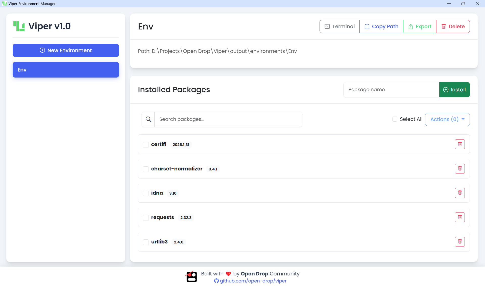

# 🐍 Viper Environment Manager

<p align="center">
  
</p>

<p align="center">
  <strong>A beautiful, intuitive Python virtual environment manager</strong>
</p>

<p align="center">
  <a href="#features">Features</a> •
  <a href="#installation">Installation</a> •
  <a href="#usage">Usage</a> •
  <a href="#development">Development</a> •
  <a href="#license">License</a>
</p>

## 📋 Overview

Viper Environment Manager is a modern desktop application for creating and managing Python virtual environments with ease. It provides a clean, intuitive interface for managing Python environments, packages, and dependencies.

<p align="center">
  
  <br>
  <em>Elegant interface for managing Python environments</em>
</p>

## ✨ Features

- **Environment Management**
  - Create new virtual environments
  - Delete existing environments
  - Launch terminals with environments activated
  - Export environments to requirements.txt

- **Package Management**
  - View installed packages with versions
  - Install new packages
  - Uninstall packages
  - Search installed packages
  - Bulk-select packages for operations

- **User Experience**
  - Modern, responsive UI
  - Intuitive design
  - Copy environment paths to clipboard
  - Export selected packages to requirements files

## 🚀 Installation

### Prerequisites
- Python 3.6 or higher
- pip package manager

### Setup

1. Clone the repository:
   ```bash
   git clone https://github.com/open-drop/viper.git
   cd viper
   ```

2. Install dependencies:
   ```bash
   pip install eel
   ```

3. Run the application:
   ```bash
   python environment_manager.py
   ```

## 🔧 Usage

### Creating a New Environment
1. Click the "New Environment" button
2. Enter a name for your environment
3. Click "Create"

### Managing Packages
1. Select an environment from the sidebar
2. View installed packages in the main panel
3. Use the search box to filter packages
4. Install new packages by entering the package name and clicking "Install"
5. Uninstall packages by clicking the trash icon next to the package

### Exporting Environments
1. Select an environment
2. Click the "Export" button
3. Enter a filename (defaults to requirements.txt)
4. Click "Export"

### Bulk Operations
1. Select multiple packages using checkboxes
2. Use the "Actions" dropdown to perform operations on selected packages:
   - Uninstall multiple packages
   - Export selected packages to a requirements file

## 🛠️ Development

### Project Structure
```
Mini Conda/
├── web/                    # Frontend assets
│   ├── index.html          # Main HTML interface
│   ├── style.css           # CSS styles
│   ├── env_manager.js      # JavaScript for UI interactions
│   └── Viper.png           # Logo assets
├── environment_manager.py  # Python backend using Eel
└── README.md               # Project documentation
```

### Technologies Used
- **Backend**: Python with Eel for desktop UI
- **Frontend**: HTML, CSS, JavaScript
- **UI Framework**: Bootstrap 5
- **Icons**: Bootstrap Icons

## 📝 License

This project is licensed under the [Apache License 2.0](LICENSE) - see the [LICENSE](LICENSE) file for details.

---

<p align="center">
  
  <br>
  Built with ❤️ by <strong>Open Drop</strong> Community
</p>
